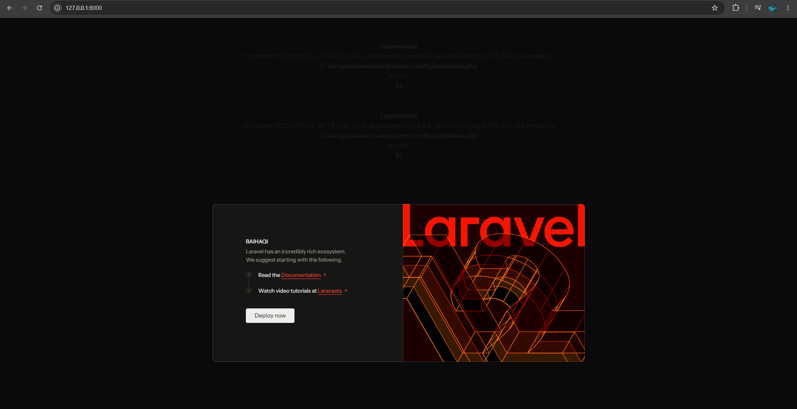
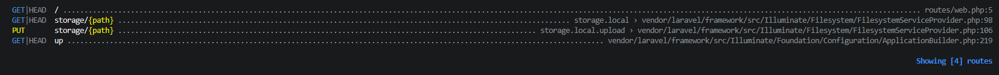

1. Buka public/index.php. Baca dari atas ke bawah. Tulis dalam 3 kalimat apa yang dilakukan berkas ini.

**jawaban:** Berkas ini mencatat waktu mulai eksekusi aplikasi dan memeriksa apakah aplikasi sedang dalam mode pemeliharaan (maintenance mode). berkas ini memuat autoloader Composer untuk mengelola dependency dan melakukan bootstrap terhadap instance aplikasi Laravel. berkas ini menangkap HTTP request yang masuk dari pengguna dan menyerahkannya ke aplikasi Laravel untuk diproses hingga menghasilkan response.

2. Buka bootstrap/app.php. Identifikasi bagian mana yang mengurus route, mana yang mengurus middleware, mana yang mengurus exception.

**jawaban:**
- Mengurus route
```php
->withRouting(
    web: __DIR__.'/../routes/web.php',
    commands: __DIR__.'/../routes/console.php',
    health: '/up',
)
```
Mendaftarkan berkas-berkas definisi rute aplikasi (seperti rute web, command konsol/Artisan, serta endpoint health check /up).

- Mengurus middleware
```php
->withMiddleware(function (Middleware $middleware) {
    //
})
```
Mengonfigurasi middleware global, alias middleware, grup middleware, atau menambahkan middleware kustom untuk menyaring HTTP request sebelum sampai ke controller/route handler.

- Mengurus exception
```php
->withExceptions(function (Exceptions $exceptions) {
    //
})->create();
```
Mengatur penanganan kesalahan (error & exception handling), seperti menentukan bagaimana exception tertentu dilaporkan (reported) atau ditampilkan ke pengguna (rendered).

3. Buka routes/web.php. Temukan route yang menghasilkan halaman selamat datang. Ubah teksnya, muat ulang browser, pastikan berubah.

**jawaban:**


4. Jalankan php artisan route:list. Cocokkan keluarannya dengan isi routes/web.php

**jawaban:**
