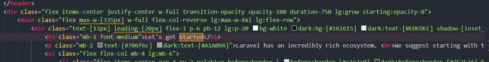
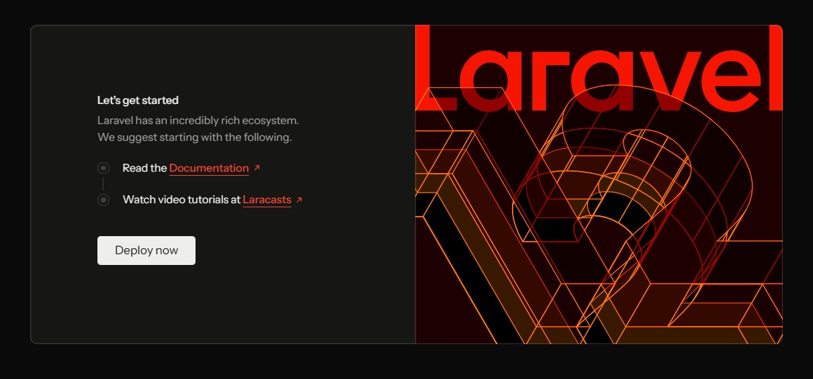
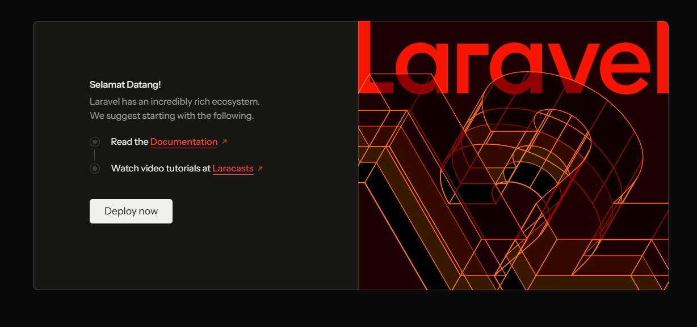
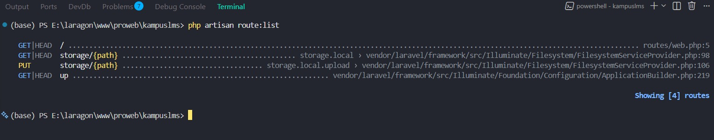

## Catatan 1.3

Nama : **Devina Dian Saputri**      
NIM : **10241022**

---
### Read

1. Buka public/index.php. Baca dari atas ke bawah. Tulis dalam 3 kalimat apa yang dilakukan berkas ini.     
   _Jawaban_ : Dari kode yang ada didalam public/index.php menjelaskan mengenai pintu masuk utama yang menyambut setiap ada yang mengunjungi website. Tugas utamanya adalah menyiapkan semua kebutuhan sistem, seperti mencatat waktu respons, memeriksa status pemeliharaan (maintenance), dan memuat seluruh pustaka pendukung. Setelah melewati itu semua dan siap, kode ini akan memproses permintaan dari pengunjung dan menampilkan halaman website yang sesuai ke layar mereka.

2. Buka bootstrap/app.php. Identifikasi bagian mana yang mengurus route, mana yang mengurus middleware, mana yang mengurus exception.       
   _Jawaban_ :  
  **Bagian Routing** : berfungsi untuk mendaftarkan berkas-berkas pendaftaran rute dan endpoint aplikasi        
    ``` php
        ->withRouting(
            web: __DIR__.'/../routes/web.php',
            commands: __DIR__.'/../routes/console.php',
            health: '/up',
        )
    ```
    - `web`: mendaftarkan file `routes/web.php` yang berisi daftar alamat URL website yang bisa diakses pengguna melalui browser (seperti halaman utama, profil, atau kontak).
    - `commands`: mendaftarkan file `routes/console.php` untuk perintah-perintah khusus yang dijalankan lewat terminal/command prompt.
    - `health`: menyediakan rute khusus di `/up` untuk mengecek apakah aplikasi kamu sedang berjalan normal atau bermasalah.            
  
    **Bagian Middleware** : berfungsi untuk mengonfigurasi rantai penyaring HTTP
    ``` php
        ->withMiddleware(function (Middleware $middleware) {
            //
        })
    ```
    Mendaftarkan fungsi atau kelas penyaring yang dieksekusi sebelum request mencapai controller atau setelah respon dihasilkan. Contoh operasinya meliputi: pemeriksaan autentikasi sesi (session authentication), enkripsi cookie, enkapsulasi enkripsi CSRF, dan pembatasan laju akses (rate limiting).

    **Bagian Exception** : berfungsi untuk mengonfigurasi pengolahan dan pelaporan kesalahan (Error & Exception Handler)
    ``` php
        ->withExceptions(function (Exceptions $exceptions) {
            //
        })
    ```
    Menangkap (catch) semua throwable error atau exception yang terjadi saat runtime. Di sini bisa mengubah perilaku respon ketika terjadi error (misalnya mengubah output error menjadi format JSON tertentu untuk API) atau menentukan error mana saja yang harus dicatat ke dalam log server maupun layanan pemantauan pihak ketiga.

3. Buka routes/web.php. Temukan route yang menghasilkan halaman selamat datang. Ubah teksnya, muat ulang browser, pastikan berubah.         
   _Jawaban_ :         
   Letak tempat diubah ada pada `resources/views/welcome.blade.php`
   
   ini adalah tempilan awalnya
   
   dan ini adalah tampilan ketika teks diubah
   

4. Jalankan php artisan route:list. Cocokkan keluarannya dengan isi routes/web.php.
   _Jawaban_ :      
   
   
   
