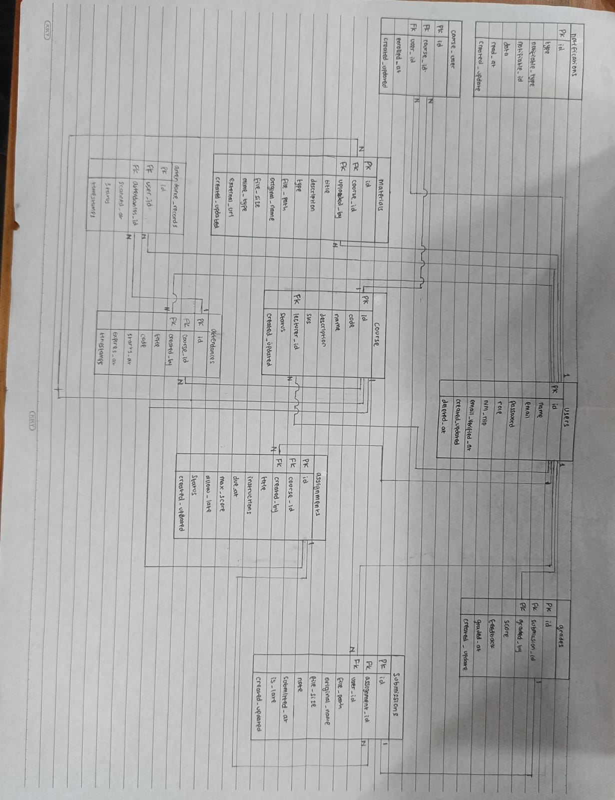

# Read Kelompok 2 Pemrograman Web

1. Gambar ulang ERD dari spesifikasi di papan/kertas, tanpa melihat dokumen.

_Jawaban_: 

2. Untuk setiap foreign key, tentukan perilaku onDelete-nya dan tuliskan alasannya.

_Jawaban_:

Analisis Perilaku onDelete pada Foreign Key

| Tabel Asal | Kolom Foreign Key | Tabel Tujuan | Perilaku `onDelete` | Alasan |
| :--- | :--- | :--- | :--- | :--- |
| `courses` | `lecturer_id` | `users(id)` | `restrictOnDelete` | Mencegah hapus dosen yang masih punya MK aktif|
| `course_user` | `course_id` | `courses(id)` | `cascadeOnDelete` | Hapus otomatis data pendaftaran jika MK dihapus |
| `course_user` | `user_id` | `users(id)` | `cascadeOnDelete` | Hapus otomatis data pendaftaran jika mahasiswa dihapus |
| `materials` | `course_id` | `courses(id)` | `cascadeOnDelete` | Hapus otomatis semua materi jika MK dihapus |
| `materials` | `uploaded_by` | `users(id)` | `restrictOnDelete` | Menjaga agar materi tidak hilang saat pengunggah dihapus |
| `assignments` | `course_id` | `courses(id)` | `cascadeOnDelete` | Hapus otomatis semua tugas jika MK dihapus |
| `assignments` | `created_by` | `users(id)` | `restrictOnDelete` | Mencegah hapus dosen yang memiliki tugas aktif |
| `submissions` | `assignment_id` | `assignments(id)` | `cascadeOnDelete` | Hapus otomatis berkas kumpul jika tugas dihapus |
| `submissions` | `user_id` | `users(id)` | `cascadeOnDelete` | Hapus otomatis berkas kumpul jika mahasiswa dihapus |
| `grades` | `submission_id` | `submissions(id)` | `cascadeOnDelete` | Hapus otomatis nilai jika berkas tugas dihapus |
| `grades` | `graded_by` | `users(id)` | `restrictOnDelete` | Menjaga riwayat dosen yang memberikan nilai |
| `attendances` | `course_id` | `courses(id)` | `cascadeOnDelete` | Hapus otomatis semua presensi jika MK dihapus |
| `attendances` | `created_by` | `users(id)` | `restrictOnDelete` | Menjaga riwayat pembuat sesi presensi |
| `attendance_records` | `attendance_id` | `attendances(id)` | `cascadeOnDelete` | Hapus otomatis rekam hadir jika sesi presensi dihapus |
| `attendance_records` | `user_id` | `users(id)` | `cascadeOnDelete` | Hapus otomatis rekam hadir jika mahasiswa dihapus |

3. Jawab: kalau seorang dosen dihapus, apa yang terjadi pada mata kuliahnya? Kenapa dirancang begitu?

_Jawaban_: Mata kuliah tetap ada, namun proses penghapusan akun dosen akan ditolak dan digagalkan oleh sistem (muncul pesan error database). Akun dosen tersebut tidak bisa dihapus selama ia masih tercatat sebagai pengampu di suatu mata kuliah aktif karena menggunakan `restrictOnDelete`.

4. Jawab: kenapa `grades.submission_id` bersifat unique, bukan sekadar index biasa?

_Jawaban_: `grades.submission_id` dibuat bersifat UNIQUE untuk menegaskan aturan bisnis bahwa satu pengumpulan tugas (submission) hanya boleh memiliki tepat satu nilai (grade) yang berguna untuk mencegah duplikasi nilai, integritas data di tingkat database, dan mempermudah query & relasi eloquent.
